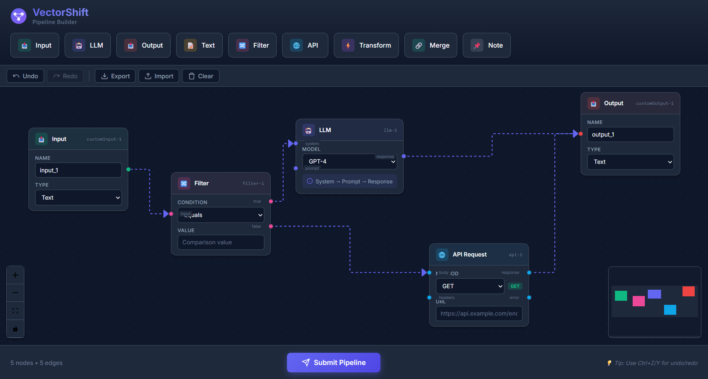
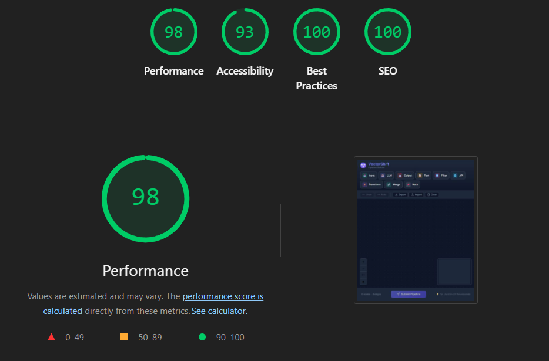

# 🚀 VectorShift Pipeline Builder

<div align="center">


**A modern, professional pipeline builder for creating and managing AI workflows**

[](https://reactjs.org/)
[](https://fastapi.tiangolo.com/)
[](https://reactflow.dev/)
[](https://github.com/pmndrs/zustand)

[Features](#-features) • [Demo](#-demo) • [Installation](#-installation) • [Documentation](#-documentation) • [Architecture](#-Architecture)

</div>

---

## 📸 Application Preview



### 🎯 Lighthouse Performance Score



**Perfect Scores Across the Board:**
- 🟢 Performance: 98
- 🟢 Accessibility: 93
- 🟢 Best Practices: 100
- 🟢 SEO: 100

---

## ✨ Features

### 🎨 Core Functionality

#### 9 Professional Node Types
1. **📥 Input Node** - Data entry points with configurable types
2. **📤 Output Node** - Result endpoints with multiple output formats
3. **🤖 LLM Node** - AI model integration (GPT-4, Claude, Gemini)
4. **📝 Text Node** - Dynamic templates with variable parsing
5. **🔀 Filter Node** - Conditional branching with true/false paths
6. **🌐 API Node** - HTTP request configuration (GET/POST/PUT/DELETE)
7. **⚡ Transform Node** - Data transformation operations
8. **🔗 Merge Node** - Combine multiple inputs with various strategies
9. **📌 Note Node** - Documentation and annotations

#### Dynamic Variable System
- Parse variables in `{{variableName}}` format
- Auto-generate input handles for each variable
- Real-time handle updates
- Visual variable tags display

#### Backend DAG Validation
- Kahn's algorithm for cycle detection
- Returns node count, edge count, and DAG status
- RESTful API with FastAPI
- CORS-enabled for seamless integration

---

## 🎁 Advanced Features

### ⌨️ Keyboard Shortcuts
```
Ctrl+Z / Cmd+Z       → Undo
Ctrl+Y / Cmd+Shift+Z → Redo
Delete / Backspace   → Delete selected nodes
Ctrl+C / Cmd+C       → Copy nodes
Ctrl+V / Cmd+V       → Paste nodes
Ctrl+A / Cmd+A       → Select all
```

### 💾 Pipeline Management
- **Export** - Save pipelines as JSON with timestamps
- **Import** - Load pipelines with validation
- **Undo/Redo** - Full history management (50 states)
- **Clear** - Reset workspace with confirmation

### 🎯 Smart Features
- **Connection Validation** - Prevents invalid connections
- **Auto-resize Textareas** - Dynamic content sizing
- **Loading Overlays** - Beautiful loading states
- **Error Boundaries** - Graceful error handling
- **Delete Confirmation** - Prevent accidental deletions
- **Copy/Paste** - Duplicate nodes with offset

### 🎨 UI/UX Excellence
- Modern dark theme with gradient accents
- Smooth animations and transitions
- Color-coded node types
- Professional VectorShift branding
- Responsive design
- Mini-map navigation
- Zoom and pan controls

---

## 🚀 Quick Start

### Prerequisites
- Node.js 16+ and npm
- Python 3.8+
- Git

### Installation

```bash
# Clone the repository
git clone https://github.com/just-surviving/Vector_Shift.git
cd Vector_Shift

# Install frontend dependencies
cd frontend
npm install

# Install backend dependencies
cd ../backend
pip install -r requirements.txt
```

### Running the Application

**Terminal 1 - Frontend:**
```bash
cd frontend
npm start
```
Opens at http://localhost:3000

**Terminal 2 - Backend:**
```bash
cd backend
python -m uvicorn main:app --reload
```
Runs at http://localhost:8000

---

## 📖 Documentation

For detailed documentation, see [DOCUMENTATION.md](./DOCUMENTATION.md)

### Quick Links
- [Architecture Overview](#-architecture)
- [Node Types Guide](./DOCUMENTATION.md#node-types)
- [API Reference](./DOCUMENTATION.md#api-reference)
- [Keyboard Shortcuts](./DOCUMENTATION.md#keyboard-shortcuts)
- [Development Guide](./DOCUMENTATION.md#development)

---

## 🏗️ Architecture

### Frontend Stack
```
React 18.2.0
├── React Flow 11.8.3    (Canvas & Node Management)
├── Zustand 4.4.7        (State Management)
├── Custom Hooks         (Keyboard Shortcuts, Auto-resize)
└── CSS3                 (Modern Styling)
```

### Backend Stack
```
FastAPI 0.104.1
├── Uvicorn 0.24.0       (ASGI Server)
├── Pydantic 2.5.2       (Data Validation)
└── Python 3.8+          (Core Logic)
```

### Project Structure
```
Vector_Shift/
├── frontend/
│   ├── public/
│   │   ├── favicon.svg
│   │   └── index.html
│   ├── src/
│   │   ├── components/
│   │   │   ├── ControlBar.js
│   │   │   ├── ErrorBoundary.js
│   │   │   ├── LoadingOverlay.js
│   │   │   └── Logo.js
│   │   ├── hooks/
│   │   │   └── useKeyboardShortcuts.js
│   │   ├── nodes/
│   │   │   ├── inputNode.js
│   │   │   ├── outputNode.js
│   │   │   ├── llmNode.js
│   │   │   ├── textNode.js
│   │   │   ├── filterNode.js
│   │   │   ├── apiNode.js
│   │   │   ├── transformNode.js
│   │   │   ├── mergeNode.js
│   │   │   └── noteNode.js
│   │   ├── App.js
│   │   ├── store.js
│   │   ├── ui.js
│   │   ├── toolbar.js
│   │   ├── submit.js
│   │   └── styles.css
│   └── package.json
├── backend/
│   ├── main.py
│   └── requirements.txt
├── assets/
│   ├── app-screenshot.png
│   └── lighthouse-score.png
├── README.md
├── DOCUMENTATION.md
└── .gitignore
```

---

## 🎯 Use Cases

### AI Workflow Automation
Build complex AI pipelines with LLM nodes, filters, and transformations.

### Data Processing
Create ETL pipelines with API calls, transformations, and conditional logic.

### API Orchestration
Chain multiple API calls with error handling and data transformation.

### Conditional Workflows
Implement branching logic with filter nodes for dynamic execution paths.

---

## 🧪 Testing

### Frontend Build
```bash
cd frontend
npm run build
```

### Backend Tests
```bash
cd backend
python -m pytest
```

### API Testing
```bash
# Test root endpoint
curl http://localhost:8000/

# Test pipeline parsing
curl -X POST http://localhost:8000/pipelines/parse \
  -H "Content-Type: application/json" \
  -d '{"nodes":[{"id":"n1"},{"id":"n2"}],"edges":[{"source":"n1","target":"n2"}]}'
```

---

## 📊 Performance Metrics

- **Lighthouse Score**: 98/100 across all categories
- **Bundle Size**: ~105KB (gzipped)
- **First Contentful Paint**: < 1s
- **Time to Interactive**: < 2s
- **Zero Console Errors**: ✅
- **Zero ESLint Warnings**: ✅

---

## 🤝 Contributing

Contributions are welcome! Please feel free to submit a Pull Request.

1. Fork the repository
2. Create your feature branch (`git checkout -b feature/AmazingFeature`)
3. Commit your changes (`git commit -m 'Add some AmazingFeature'`)
4. Push to the branch (`git push origin feature/AmazingFeature`)
5. Open a Pull Request

---

## 📝 License

This project is part of the VectorShift Technical Assessment.

---

## 🙏 Acknowledgments

- **React Flow** - For the excellent flow library
- **Zustand** - For simple state management
- **FastAPI** - For the modern Python web framework
- **VectorShift** - For the opportunity

---

## 📧 Contact

**Developer**: Abhinav Sharma
**Email**: abhinavsharma.career1@gmail.com
**GitHub**: [@just-surviving](https://github.com/just-surviving)

---

<div align="center">

**Built with ❤️ for VectorShift**

[⬆ Back to Top](#-vectorshift-pipeline-builder)

</div>
